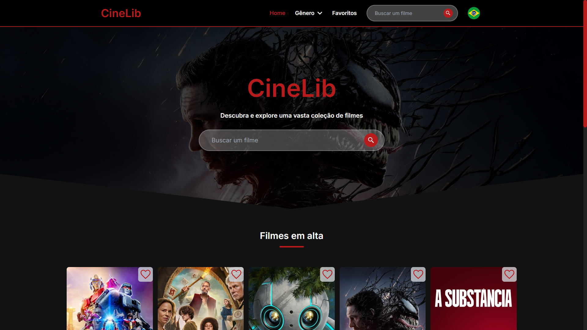
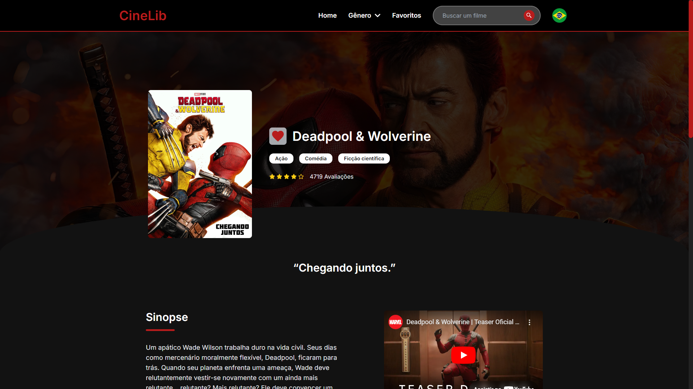
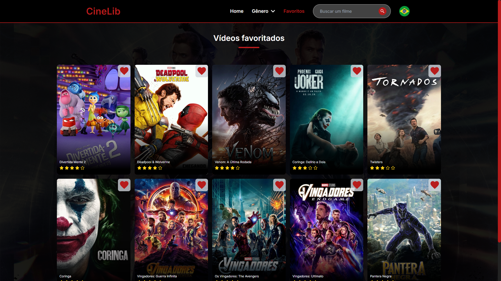

<div align="center"> <h1>CineLib</h1> </div>

<p align="center">Explore uma vasta coleção de filmes e acesse informações detalhadas sobre suas obras favoritas!</p>

<p align="center">
  
  
  
</p>

## 📝 Sobre o projeto

O **CineLib** é uma aplicação que oferece uma plataforma completa para visualizar informações detalhadas sobre filmes, como sinopse, orçamento, elenco e outros detalhes. O projeto lista os filmes mais populares do momento e disponibiliza um sistema de busca por título ou categorias, permitindo acesso a um extenso catálogo de filmes. Além disso, com o suporte da biblioteca i18n, o site pode ser traduzido para inglês e português, ampliando sua acessibilidade para diferentes públicos.

O **CineLib** é uma aplicação que oferece uma plataforma completa para visualizar informações detalhadas sobre filmes, como sinopse, orçamento, elenco e outros detalhes. O projeto lista os filmes mais populares do momento e disponibiliza um sistema de busca por título ou categorias, permitindo acesso a um extenso catálogo de filmes. Os usuários também podem favoritar filmes, que são armazenados localmente, permitindo a criação de uma lista personalizada. Além disso, com o suporte da biblioteca i18n, o site pode ser traduzido para inglês e português, ampliando sua acessibilidade para diferentes públicos.

## 🛠 Tecnologias utilizadas

-   **React.js** - Biblioteca JavaScript para construção de interfaces
-   **Vite** - Ferramenta de build rápida para desenvolvimento front-end
-   **JavaScript** - Linguagem de programação
-   **HTML** - Estrutura do conteúdo
-   **CSS** - Estilização da interface
-   **SASS** - Extensão do CSS com recursos poderosos
-   **Tailwind CSS** - Framework de estilos
-   **i18n** - Biblioteca para internacionalização

## 📸 Screenshots

<p align="center">
  
</p>

<p align="center">
  
</p>

<p align="center">
  
</p>

<p align="center">
  
</p>

## 🌐 Acesse o projeto online
Você pode acessar a versão online do projeto [aqui](https://cinelib-ma.netlify.app/).

## 🖥️ Como configurar o projeto

Siga os passos abaixo para instalar e executar o projeto em seu ambiente local:

### 1. Clone o repositório:

```bash
$ git clone https://github.com/mauricio071/CineLib
```

### 2. Acesse o diretório do projeto:

```bash
$ cd CineLib
```

### 3. Instale as dependências necessárias:

```bash
$ npm install
```

### 4. Configure o ambiente:
Para que o projeto consiga consumir a API, siga estes passos:

#### 1. Crie uma conta no [TheMovieDB](https://www.themoviedb.org).
#### 2. Acesse a seção de configurações da API em seu perfil e copie sua chave API.
#### 3. Crie um arquivo .env na raiz do projeto e adicione a chave da API da seguinte forma:

```bash
VITE_API_KEY=SUA-CHAVE
```

#### 4. Complete seu arquivo .env com as URLs da API:

```bash
VITE_API_KEY=SUA-CHAVE
VITE_API=https://api.themoviedb.org/3/movie
VITE_SEARCH=https://api.themoviedb.org/3/search/movie
VITE_DISCOVER=https://api.themoviedb.org/3/discover/movie
VITE_TRENDING=https://api.themoviedb.org/3/trending/movie/week
VITE_IMG=https://image.tmdb.org/t/p/original
VITE_IMG_CARD=https://image.tmdb.org/t/p/w500
```

### 5. Inicialize o projeto:

```bash 
$ npm run dev
```
Agora você pode acessar o projeto no navegador em http://localhost:5173/ (ou na porta indicada pelo terminal).
